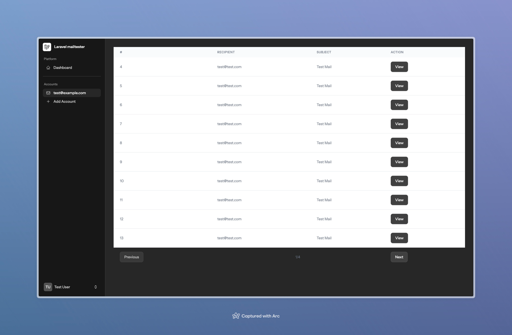
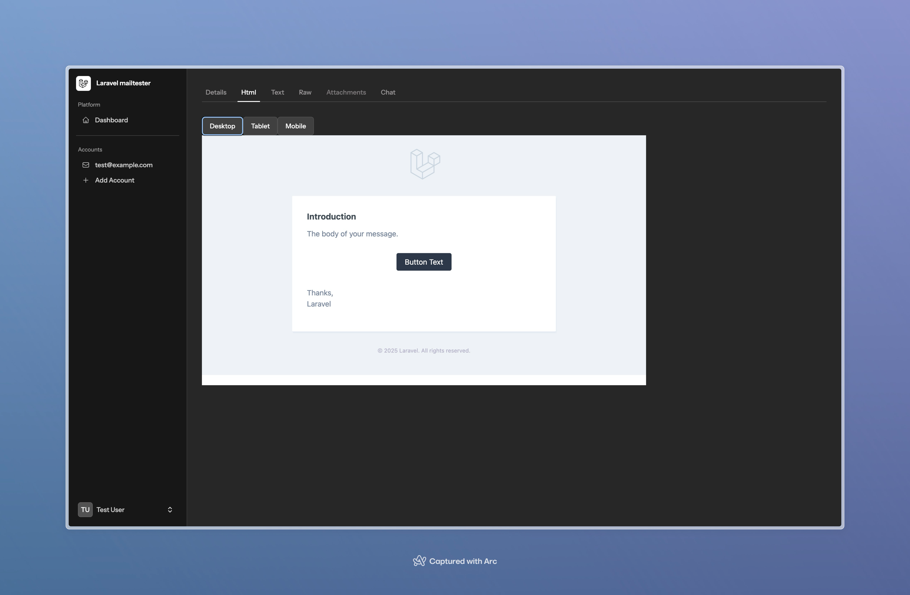
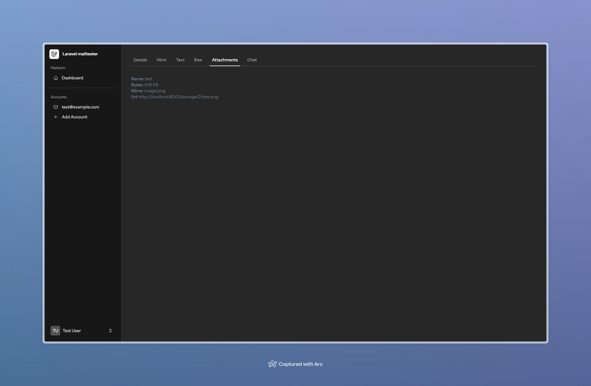
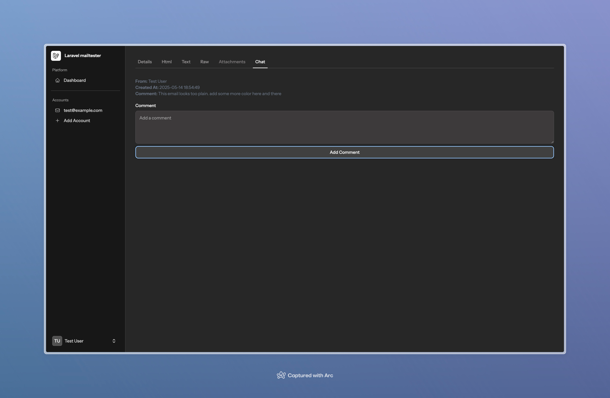

# Laravel mail tester
Receive emails from other applications and view and comment on them in a web interface.


## Screenshots
### Summary


### E-mail HTML view


### Attachments


### Comments


## Installation
1. Make sure you have php-mailparse installed. Read more on that [here](https://github.com/php-mime-mail-parser/php-mime-mail-parser)
2. Install the project using composer:
```bash
git clone git@github.com:NietThijmen/laravel-mailtester.git
cd laravel-mailtester

composer install
```
3. Copy the `.env.example` file to `.env` and fill in the required values.
```bash
cp .env.example .env
```
4. Generate the application key:
```bash
php artisan key:generate
```
5. Run the migrations:
```bash
php artisan migrate
```
6. Start the server (This is up to your environment, I'd just recommend Laravel Forge [https://forge.laravel.com/]):


## Running the service:
This is once again up to your environment, but TL;DR: Make sure you are able to run the background process for php artisan mail:server

## License
The license can be found here: [LICENSE](./LICENSE.md)

## Contributing
If you want to contribute, please do so. I am open to any suggestions and pull requests.

## Support
There's not really support needed for a small project like this, but if you have any questions or suggestions, please feel free to open an issue or a pull request.

## Support me
If you like this project and want to support me, please consider buying me a coffee. You can do so by clicking the button below:

<a href="https://www.buymeacoffee.com/nietthijmen"></a>

